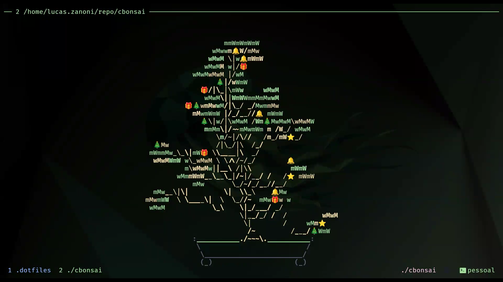

# cbonsai 🎄



`cbonsai` is a bonsai tree generator, written in `C` using `ncurses`. It intelligently creates, colors, and positions a bonsai tree, and is entirely configurable via CLI options-- see [usage](#usage). There are 2 modes of operation: `static` (see finished bonsai tree), and `live` (see growth step-by-step).

## 🎄 Christmas Edition Fork

**This is a fork of the original [cbonsai by jallbrit](https://gitlab.com/jallbrit/cbonsai)** with added ornament features! 

This version adds Christmas-themed ornaments to your bonsai trees, perfect for the holiday season. You can now decorate your terminal trees with customizable ornaments, adjustable frequency, and custom colors.

**New Features:**
- `-o, --ornament=LIST` - Add custom ornament characters (like `*`, `@`, `O`, `🎄`, `⭐`, etc.)
- `-f, --frequency=INT` - Control ornament frequency (0-100%)
- `-O, --ornament-color=INT` - Set custom ornament colors

Try it: `cbonsai -l -o "🎄,⭐,🎁,🔔" -f 25 -O 9`

**Repository:** [https://github.com/Castrozan/cbonsai](https://github.com/Castrozan/cbonsai)

---

`cbonsai` is always looking for ideas for improvement- feel free to open an issue if you've got an idea or a bug!

<br>
<br>
<br>
<br>
<br>
<br>

## Installation

<a href="https://repology.org/project/cbonsai/versions">
    
</a>

`cbonsai` is available in multiple repositories. Check the repology chart to the right to see if `cbonsai` is packaged for your system. A big thank you to all the people who packaged `cbonsai`!

If no package exists for your system/distribution, you'll have to use the [manual](https://gitlab.com/jallbrit/cbonsai#manual) install instructions. Below are some more specific instructions for some distributions.

### Debian-based

`cbonsai` is available in Debian Testing and Unstable via `apt`. Robin Gustafsson has also kindly packaged `cbonsai` as a `.deb` file over in [this repository](https://gitlab.com/rgson/debian_cbonsai/-/packages).

### Fedora

Mohammad Kefah has kindly packaged `cbonsai` in the [Fedora copr](https://copr.fedorainfracloud.org/), which is "similar to what the AUR is to Arch". On Fedora, it can be installed like so:

```bash
sudo dnf copr enable keefle/cbonsai
sudo dnf install cbonsai
```

### MacOS

You may install `cbonsai` using [Homebrew](https://brew.sh):

```bash
brew install cbonsai
```

You may also install `cbonsai` using [MacPorts](https://www.macports.org). Simply install MacPorts, then issue the following commands:

```bash
sudo port selfupdate
sudo port install cbonsai
```

### Nix / NixOS

You can build and run `cbonsai` using the Nix flake:

```bash
# Run directly without installing
nix run github:jallbrit/cbonsai

# Or run from the local repository
cd cbonsai
nix run .

# Build and install to your profile
nix profile install github:jallbrit/cbonsai

# Add to your NixOS configuration or home-manager
# In your configuration.nix or home.nix:
{
  environment.systemPackages = [  # or home.packages for home-manager
    (pkgs.callPackage ./path/to/cbonsai {})
  ];
}

# Or use it in a development shell
nix develop
```

### Manual

You'll need to have a working `ncursesw`/`ncurses` library.

#### Debian-based

```bash
sudo apt install libncursesw5-dev
```

#### Fedora

```bash
sudo dnf install ncursesw5-devel
```

#### macOS

Follow the [Manual](#manual) installation, but if you install `ncurses` via homebrew, you may see this:

```
For pkg-config to find ncurses you may need to set:
  set -gx PKG_CONFIG_PATH "/usr/local/opt/ncurses/lib/pkgconfig"
```

You may need to follow these instructions before running `make install`.

If you are having trouble installing on MacOS, try reading [this issue](https://gitlab.com/jallbrit/cbonsai/-/issues/10).

Once dependencies are met, then install:

```bash
git clone https://gitlab.com/jallbrit/cbonsai
cd cbonsai

# install for this user
make install PREFIX=~/.local

# install for all users
sudo make install
```

## Usage

```
Usage: cbonsai [OPTION]...

cbonsai is a beautifully random bonsai tree generator.

Options:
  -l, --live             live mode: show each step of growth
  -t, --time=TIME        in live mode, wait TIME secs between
                           steps of growth (must be larger than 0) [default: 0.03]
  -i, --infinite         infinite mode: keep growing trees
  -w, --wait=TIME        in infinite mode, wait TIME between each tree
                           generation [default: 4.00]
  -S, --screensaver      screensaver mode; equivalent to -liWC and
                           quit on any keypress
  -m, --message=STR      attach message next to the tree
  -b, --base=INT         ascii-art plant base to use, 0 is none
  -c, --leaf=LIST        list of comma-delimited strings randomly chosen
                           for leaves
  -k, --color=LIST       list of 4 comma-delimited color indices (0-255) for
                           each of dark leaves, dark wood, light leaves, and
                           light wood, in that order [default: 2,3,10,11]
  -M, --multiplier=INT   branch multiplier; higher -> more
                           branching (0-20) [default: 5]
  -L, --life=INT         life; higher -> more growth (0-200) [default: 32]
  -p, --print            print tree to terminal when finished
  -s, --seed=INT         seed random number generator
  -W, --save=FILE        save progress to file [default: ~/.cache/cbonsai]
  -C, --load=FILE        load progress from file [default: ~/.cache/cbonsai]
  -v, --verbose          increase output verbosity
  -h, --help             show help
```

## Tips

### Screensaver Mode

Try out `-S/--screensaver` mode! As the help message states, it activates the `--live` and `--infinite` modes, quits upon any keypress, also saves/loads using the default cache file (`~/.cache/cbonsai`). This means:

* When you start `cbonsai` with `--screensaver`, a tree (including its seed and progress) is loaded from the default cache file.
* When you quit `cbonsai` and `--screensaver` was on, the current tree being generated (including its seed and progress) is written to the default cache file.

This is helpful for a situations like the following: let's say you're growing a really big tree, really slowly:

```bash
$ cbonsai --life 40 --multiplier 5 --time 20 --screensaver
```

Normally, when you quite `cbonsai` (e.g. by you hitting `q` or `ctrl-c`), you would lose all progress on that tree. However, by specifying `--screensaver`, the tree is automatically saved to a cache file upon quitting. The next time you run that exact same screensaver command:

```bash
$ cbonsai --life 40 --multiplier 5 --time 20 --screensaver
```

The tree is automatically loaded from the cache file! And, since infinite mode is automatically turned on, it will finish the cached tree and just keep generating more. When you quit `cbonsai` again, the tree is once again written to the cache file for next time.

Keep in mind that only the seed and number of branches are written to the cache file, so if you want to continue a previously generated tree, make sure you re-specify any other options you may have changed.

### Add to `.bashrc`

For a new bonsai tree every time you open a terminal, just add the following to the end of your `~/.bashrc`:

```bash
cbonsai -p
```

Notice it uses the print mode, so that you can immediately start typing commands below the bonsai tree.

### Infinite Mode With `fortune` or Similar

If you want to run `cbonsai --infinite --message $(fortune)`, you'll quickly notice that `fortune` only runs once, and the same message is on each tree. What if you could run `fortune` each time, for a fresh message? Or some other program that gives you text?

`cbonsai` does not include an "--exec" feature, but you can emulate this functionality by wrapping `cbonsai` in a bash script, like the one below:

```bash
#!/bin/bash
WAITTIME=15

clear

while true; do
	echo -ne "\e[?25l"
	timeout -f "$WAITTIME" ./cbonsai -m "$(fortune)"    # --live also works
	echo -ne "\e[?25l"
	sleep 2
done
```

This script uses an ANSI escape sequence to hide the cursor, then runs `cbonsai`, using `timeout` to kill the process after `$WAITTIME` seconds. Then, it sleeps for 2 seconds, and starts another tree.

## How it Works

`cbonsai` starts by drawing the base onto the screen, which is basically just a static string of characters. To generate the actual tree, `cbonsai` uses a ~~bunch of if statements~~ homemade algorithm to decide how the tree should grow every step. Shoots to the left and right are generated as the main trunk grows. As any branch dies, it branches out into a bunch of leaves.

`cbonsai` has rules for which character and color it should use for each tiny branch piece, depending on things like what type of branch it is and what direction it's facing.

The algorithm is tweaked to look best at the default size, so larger sized trees may not be as bonsai-like.

## Inspiration & Credits

This project wouldn't be here if it weren't for its *roots*! 

**This Christmas Edition fork** is based on the original [cbonsai by jallbrit](https://gitlab.com/jallbrit/cbonsai), which is a newer version of [bonsai.sh](https://gitlab.com/jallbrit/bonsai.sh), which was written in `bash` and was itself a port of [this bonsai tree generator](https://avelican.github.io/bonsai/) written in `javascript`.

All credit for the core bonsai generation algorithm and original codebase goes to [jallbrit](https://gitlab.com/jallbrit) and the original contributors. This fork simply adds festive ornament decorations to bring some holiday cheer to your terminal! 🎄✨
